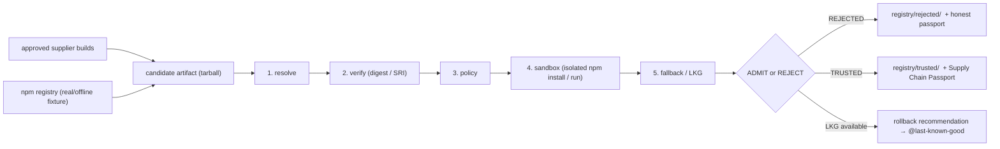
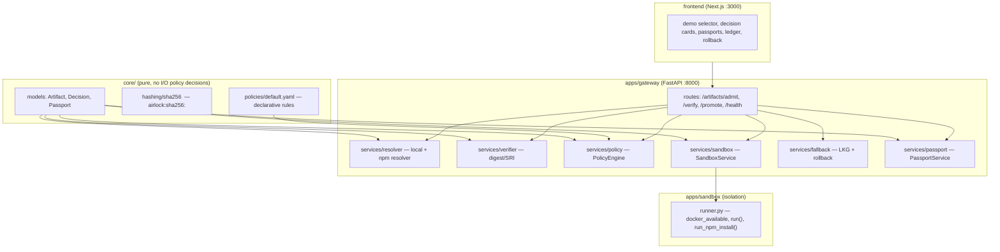

# AIRLOCK Architecture

AIRLOCK is a **gatekeeper**, not a package registry and not a monitoring tool.
It sits in front of the point where third-party software would enter a trusted
build chain and decides, per artifact, **ADMIT or REJECT**.

## High-level flow



The pipeline is deliberately **linear and fail-closed**: every stage gates the
next, and the *result* object carries all check statuses plus the artifact's
passport.

## Components



## Identity

Artifact identity is **exact bytes**:

```
airlock:sha256:<hex sha256 of the uncompressed artifact bytes>
```

- A one-byte mutation → different ID → different passport → check `tamper`
  fails when the artifact is expected from a known digest.
- For npm, AIRLOCK additionally pins the **integrity** (`sha512`) from registry
  metadata and requires it to match the downloaded tarball **before** anything
  is executed.

## Admission pipeline (fail-closed)

Each stage writes a check result; any `failed` ⇒ `REJECTED`.

1. **identity** — resolve path, compute digest, build Artifact.
2. **integrity** — expected digest pinning + optional trusted-copy comparison.
3. **npm-integrity** — SRI `sha512` from registry metadata vs tarball.
4. **lifecycle** — detect `preinstall`/`install`/`postinstall`/`prepare`;
   report the schedule, never execute outside the sandbox.
5. **source** — declared source must match policy (`internal-approved-registry`,
   never a public/untrusted label for production artifacts).
6. **policy** — `PolicyEngine` evaluates `default.yaml`: publishers, version
   pins, per-scope rules. Unknown package ⇒ fail closed (no policy rule).
7. **sandbox** — `SandboxService`:
   - `docker`: build image once, run `npm install` (or probe script) with
     `--network none`, capture events (network/ssh/env/filesystem/lifecycle).
   - `simulate`: deterministic simulation (Docker-independent embedding).
   - fail-closed: if requested `docker` but daemon missing → `failed`.
8. **fallback** — promotion writes the LKG record; rejection never mutates LKG;
   `rollback(package)` recommends the last known good version.

## Data flow between services (contracts)

Inputs/outputs are plain dictionaries and pydantic models defined in
`core/models/`. Full signatures: [`docs/contracts.md`](contracts.md).

## Sandbox modes

- **auto** → docker if `docker_available()` else simulate.
- **docker** → requires daemon; fails closed otherwise.
- **simulate** → deterministic, offline-safe, used for CI/hacktime.

The passport records which mode actually ran (`sandbox.mode`), so a claim of
"isolated execution" is never fabricated.

## API surface

| Method | Path | Purpose |
|---|---|---|
| `GET` | `/health` | liveness + DB |
| `GET` | `/events` | audit trail of decisions |
| `POST` | `/artifacts/admit` | local tarball admission |
| `POST` | `/artifacts/admit/npm` | real npm `name@version` admission |
| `GET` | `/artifacts` | artifact ledger |
| `GET` | `/artifacts/{id}` | single artifact |
| `GET` | `/artifacts/{id}/passport` | Supply Chain Passport |
| `POST` | `/artifacts/verify` | digest verification |
| `POST` | `/artifacts/{id}/promote` | promote to trusted |
| `POST` | `/artifacts/rollback/{package}` | LKG fallback for a package |

## Frontend

Next.js 16 + TypeScript + Tailwind, talking directly to the gateway at
`NEXT_PUBLIC_API_BASE` (default `http://localhost:8000`). Screens:
demo scenario selector, decision card (all checks), Supply Chain Passport,
recent decisions audit trail, artifact ledger, rollback button per rejected
artifact.

## Deployment (docker-compose)

- `gateway` on `:8000` (FastAPI), mounts `.` and `docker.sock`.
- `frontend` on `:3000` (Next.js), builds itself.
- `airlock-data` volume persists the registry + DB. When Docker daemon is not
  reachable from the gateway container, set `AIRLOCK_SANDBOX_ENABLED=false` so
  passports honestly report `simulate`.